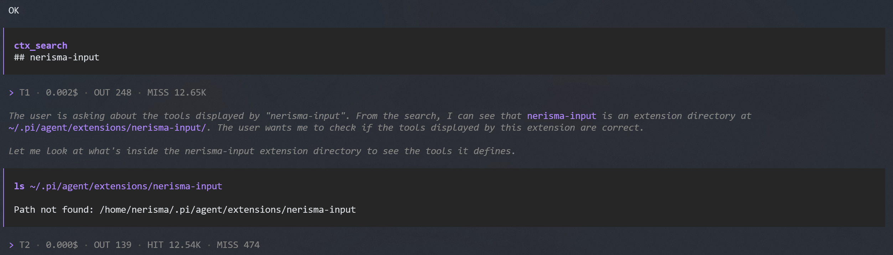

# @nerisma/pi-turn-usage-notifications

Shows a **notification after every turn** in [pi](https://pi.dev) with the usage
metrics of the assistant's reply:

```
> T1 · 0.186$ · OUT 7.79K · HIT 1.41M · MISS 79.60K
```

| Segment  | Meaning |
|----------|---------|
| `T1`     | Turn number |
| `0.186$` | Total cost of the turn |
| `OUT`    | Generated tokens (output) |
| `HIT`    | Tokens read from cache (cache read) |
| `MISS`   | Uncached input tokens (input) |

Colors follow the active theme (`accent` / `muted` / `dim`).



## Installation

```bash
pi install npm:@nerisma/pi-turn-usage-notifications
```

Or via `settings.json`:

```json
{
  "packages": ["npm:@nerisma/pi-turn-usage-notifications"]
}
```

## How it works

The extension subscribes to the `turn_end` event. When a turn ends it reads the
usage off the assistant message (`event.message.usage`), which carries the cost
breakdown (`cost.total`) and the token counts (`output`, `cacheRead`, `input`).

`usage` is not declared on the message union type in pi's published types, so it
is read through a narrow local cast; the field is present on the assistant
message at runtime.

Each metric becomes a segment, formatted with `formatTokens` (e.g. `7.79K`,
`1.41M`) and colored with the theme's ANSI codes. Empty segments are dropped: a
zero cost, or a turn with no cache activity, simply does not appear. The segments
are joined with a dim `·` separator and emitted as a single line through
`ctx.ui.notify(line, "info")`.

## Compatibility

- pi `>= 0.78`

## License

MIT © Sébastien SERVOUZE
